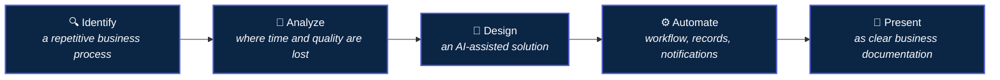
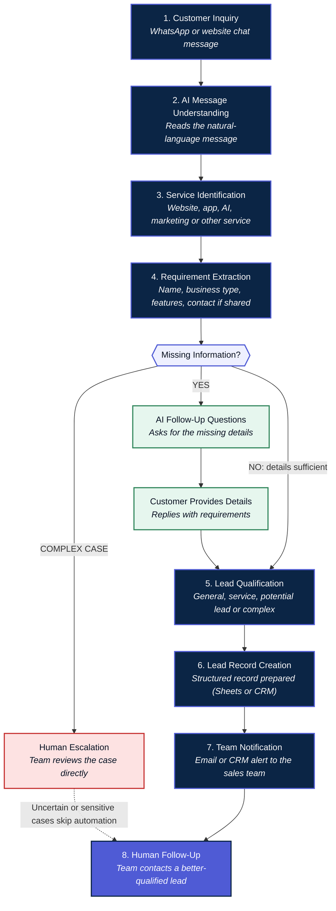
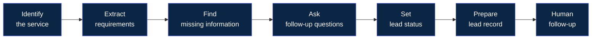
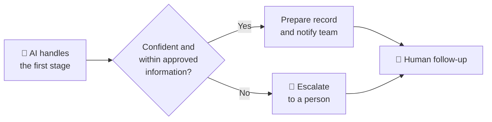
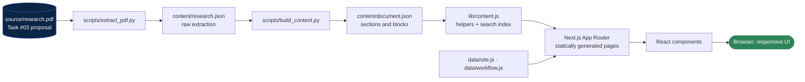
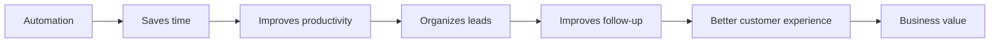
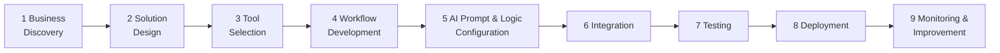

<!-- ============================ HERO ============================ -->
<div align="center">


### 🤖 Practical Task #03 · AI Automation Internship · Zayan Soft Tech

<a href="#automation-workflow">
  
</a>

</div>

<p>
  <strong>Candidate:</strong> Muhammad Yasir &nbsp;•&nbsp;
  <strong>Selected business:</strong> Star Developer (sample business) &nbsp;•&nbsp;
  <strong>Status:</strong> Solution design
</p>

<p>
  
  
  
  
  
</p>

<p>
  
  
  
  
  
  
  
  
</p>

<h3>
  <a href="#-live-demo">🌐 Live Demo</a> •
  <a href="#-automation-workflow">🔄 Workflow</a> •
  <a href="#-key-features">✨ Features</a> •
  <a href="#%EF%B8%8F-installation--setup">⚙️ Setup</a> •
  <a href="#-limitations">⚠️ Limitations</a>
</h3>

<em>Innovating Digital Solutions | Empowering Digital Futures</em>

</div>

> [!IMPORTANT]
> **This repository contains a documentation and case-study web application about a *proposed* automation.**
> The automation itself is a solution design. It has not been built or deployed. No OpenAI, n8n, WhatsApp, Google Sheets or CRM integration exists in this code, and no real customer data or performance results are used. Star Developer is a sample business and the sample customer is fictional.

---

## 📑 Table of Contents

- [Overview](#-overview)
- [Live Demo](#-live-demo)
- [Project at a Glance](#-project-at-a-glance)
- [Project Objective](#-project-objective)
- [Business Context](#-business-context)
- [Business Problem](#%EF%B8%8F-business-problem)
- [Proposed AI Automation Solution](#-proposed-ai-automation-solution)
- [Automation Workflow](#-automation-workflow)
- [AI Decision Logic](#-ai-decision-logic)
- [Lead Qualification](#-lead-qualification)
- [Human Oversight](#-human-oversight)
- [Proposed Architecture](#-proposed-architecture)
- [Key Features](#-key-features)
- [UI/UX Design](#-uiux-design)
- [Technology Stack](#-technology-stack)
- [Web App Architecture](#-web-app-architecture)
- [Project Structure](#-project-structure)
- [Documentation Coverage](#-documentation-coverage)
- [Business Benefits](#-business-benefits)
- [Proposed Implementation Approach](#%EF%B8%8F-proposed-implementation-approach)
- [Limitations](#-limitations)
- [Future Enhancements](#-future-enhancements)
- [Installation & Setup](#%EF%B8%8F-installation--setup)
- [Environment Variables](#-environment-variables)
- [Build & Deployment](#-build--deployment)
- [Screenshots](#%EF%B8%8F-screenshots)
- [Security & Privacy](#-security--privacy)
- [Learning Outcomes](#-learning-outcomes)
- [Project Status](#-project-status)
- [Related Projects](#-related-projects)
- [Author](#-author)
- [Acknowledgements](#-acknowledgements)
- [License](#-license)

---

## 🌐 Overview

**AI Lead Qualification & Project Requirement Automation** is **Practical Task #03** of the **AI Automation Internship at Zayan Soft Tech**. The task asks the intern to *identify and design* an AI automation solution for a business.

The selected business is **Star Developer**, a sample IT and digital services company. The identified process is the handling of early-stage project inquiries, which arrive as short, informal messages such as *"I need an e-commerce website for my clothing business."*

The documented solution is a first-line assistant that:

- reads each inquiry and **identifies the requested service**,
- **extracts** the details already given,
- **detects what is missing** and asks short follow-up questions,
- **classifies** the inquiry and judges whether it is a potential lead,
- prepares a **structured lead record** and **notifies the right team**,
- and leaves **pricing, negotiation and every complex or sensitive decision to people**.

This repository turns the original 12-page solution proposal into an interactive documentation platform:

> 📄 Source proposal (PDF) → 🧩 structured content (JSON) → 🌐 searchable, responsive web app with an interactive workflow diagram

**Good for:** internship review, portfolio presentation, recruiter and mentor walk-throughs, and discussion with potential clients.

---

## 🚀 Live Demo

> 🔗 **No deployment URL is configured for this repository yet.**
> After deploying (see [Build & Deployment](#-build--deployment)), add the real address here:
>
> ```text
> 🚀 View Live Application → https://YOUR-DEPLOYMENT-URL
> ```

---

## 📊 Project at a Glance

| | |
|---|---|
| **Task** | Practical Task #03: Identify & Design an AI Automation Solution |
| **Proposed solution** | AI Lead Qualification & Project Requirement Automation |
| **Candidate** | Muhammad Yasir |
| **Internship** | AI Automation Internship (domain: AI Automation) |
| **Organization** | Zayan Soft Tech |
| **Business selected** | Star Developer (sample business for this exercise) |
| **Document sections** | 23, all rendered as documentation pages |
| **Qualification categories** | 4 (general, service, potential lead, complex / uncertain) |
| **Automation functions** | 12 |
| **Customer journey stages** | 12 |
| **Implementation phases** | 9 (proposed) |
| **Human escalation cases** | 9 |
| **Project status** | Solution Design / Proposed Automation |

---

## 🎯 Project Objective

The task follows one line of thinking:



The aim is to demonstrate **AI automation consultant thinking**: start from a real business problem, keep people in control, and recommend tools only after the process is understood. The aim is *not* to show off AI tools for their own sake.

---

## 🏢 Business Context

| Field | Detail |
|---|---|
| **Business name** | Star Developer |
| **Business type** | IT Company / Digital Services Company |
| **Main services** | Website Development, Web Application Development, Mobile Application Development, AI Solutions, AI Automation, Digital Marketing, Graphic Design, Custom Software Solutions, IT Solutions |
| **Target customers** | Businesses, startups, organizations, individuals who need digital products, companies that need software solutions, and businesses interested in automation |
| **Role in the document** | The sample business selected for this practical exercise |

> No claim is made about Star Developer's real internal operations, staff, customers or systems.

---

## ⚠️ Business Problem

**Selected problem:** AI-Powered Lead Qualification & Project Requirement Collection.

An initial inquiry tells the team *what* the customer wants, but not the details needed to plan the work: number of products, payment methods, delivery needs, existing domain or hosting, and extra features. Collecting this by hand for every inquiry is repetitive, and the cost grows with the number of inquiries.

The proposal analyses a typical manual process:

| # | Step | Manual activity | Where time or quality is lost |
|---|---|---|---|
| 1 | Read and identify | Read each message and decide which service is needed | Messages wait until someone is free; vague wording needs interpretation |
| 2 | Ask and collect | Write clarifying questions and gather answers | The same questions are typed repeatedly; details are scattered in long chats |
| 3 | Judge lead quality | Decide if the person is a serious potential customer | Judgment can differ between people |
| 4 | Record and forward | Copy details into a sheet or CRM and inform the team | Manual data entry, possible errors, delayed handover |
| 5 | Follow up | Remember to contact the lead later | Missed or late follow-ups |

> [!NOTE]
> This is an **illustrative, realistic business-process scenario** used to find automation opportunities. It is not a record of Star Developer's actual workflow and not a set of verified statistics.

### Why AI suits this problem

Customer messages are written in natural language and every customer words things differently, which fixed-rule automation struggles with. AI can read varied messages, identify the service, extract details and write suitable follow-up questions.

---

## 💡 Proposed AI Automation Solution

Conceptually, the proposed automation would perform **twelve functions**:

| # | Function | # | Function |
|---|---|---|---|
| 1 | Receive a customer inquiry | 7 | Classify the inquiry |
| 2 | Read and understand the message | 8 | Determine potential lead status |
| 3 | Identify the requested service | 9 | Create a structured lead record |
| 4 | Extract available project information | 10 | Prepare information for the right team |
| 5 | Identify missing information | 11 | Recommend human follow-up when necessary |
| 6 | Ask relevant follow-up questions | 12 | Keep a clear record of the inquiry |

> **This project documents and presents a proposed automation solution. It is not a deployed production automation system.**

### Core structure

```text
Customer / Input  →  AI Processing  →  Automation  →  Action  →  Final Result
```

---

## 🔄 Automation Workflow

The diagram below follows the workflow diagram in the source document, including the missing-information decision and the escalation route.



### Text version

```text
Customer Inquiry
       ↓
AI Message Understanding
       ↓
Service Identification
       ↓
Requirement Extraction
       ↓
Missing Information? ──── YES ──→ AI Follow-Up Questions → Customer Provides Details ─┐
       │                                                                              │
       ├──── NO (details sufficient) ─────────────────────────────────────────────────┤
       │                                                                              ↓
       └──── COMPLEX CASE ──→ Human Escalation ───────────────┐              Lead Qualification
                                                              │                       ↓
                                                              │                Lead Record Creation
                                                              │                       ↓
                                                              │                Team Notification
                                                              │                       ↓
                                                              └────────────→  Human Follow-Up
```

### Customer journey (12 stages)

| # | Stage | What happens |
|---|---|---|
| 1 | Customer submits inquiry | A message through WhatsApp or website chat |
| 2 | AI receives message | The automation passes the message to the AI |
| 3 | AI understands request | The AI works out what the customer is asking for |
| 4 | Service identified | The AI decides which Star Developer service is needed |
| 5 | Requirements extracted | Details already given are captured |
| 6 | Missing information found | The AI compares what it has with what the team needs |
| 7 | Follow-up questions asked | Short, clear questions for the missing details |
| 8 | Lead qualified | The AI judges how likely it is a real project |
| 9 | Lead record prepared | Details organized into a structured record |
| 10 | Team notified | Sales or the project team receives a summary |
| 11 | Human follow-up | A team member contacts the customer |
| 12 | Project discussion | Scope, pricing and next steps are discussed with the team |

---

## 🧠 AI Decision Logic

The AI would sort each inquiry into **one of four categories**. The category decides what the automation does next.

| Category | When it applies | Proposed action |
|:---|:---|:---|
| 🟦 **General Inquiry** | The customer asks a basic question | Provide suitable information from approved business details |
| 🟪 **Service Inquiry** | The customer is interested in a service | Collect initial requirements and ask follow-up questions |
| 🟨 **Potential Lead** | The customer shows clear project intent | Prepare a lead record and recommend human follow-up |
| 🟥 **Complex / Uncertain Case** | The AI cannot confidently handle the request | Escalate to a human. The AI does not guess |

> [!WARNING]
> **Responsible AI rule:** when confidence is low, the AI must not invent an answer, a price or a promise. It tells the customer that a team member will help, and the case is escalated.

This is the **designed** decision logic. There is no live AI classifier in this repository.

---

## 🎯 Lead Qualification

The proposed process turns a vague message into an organized lead.



### Fictional demonstration

> *"Hi, I own a clothing business and I want an e-commerce website. I need product listings, online payments, and order management. Can someone help me?"*

| Step | Outcome |
|---|---|
| AI understanding | Requested service: E-commerce website (Website Development) |
| Extracted requirements | Clothing business; e-commerce website; product listings; online payments; order management |
| Missing information | Number of products; payment methods; delivery requirements; existing domain or hosting; additional features; contact details |
| Proposed follow-up | Six short questions (product count, payment methods, delivery options, domain or hosting, extra features, best contact method) |
| Lead status | **Potential Lead** |
| Next action | Prepare a structured lead record and notify the sales or project team. Exact pricing and scope are discussed by the team |

### Proposed lead record structure

A design suggestion only. It is **not implemented**, and the sample values are fictional.

| Field | Sample value | Field | Sample value |
|---|---|---|---|
| Lead Name | Not provided yet | Lead Status | Potential Lead |
| Contact Information | Requested from customer | Priority | Set by rules or the team |
| Business Type | Clothing business | Source | WhatsApp or website chat |
| Requested Service | Website Development | Follow-Up Status | Pending |
| Project Type | E-commerce website | Human Assigned | To be assigned |
| Requirements | Product listings, online payments, order management | Notes | Awaiting answers to follow-up questions |
| Missing Information | Product count, payment methods, delivery, hosting, extra features | | |

---

## 🤝 Human Oversight

> **AI assists the team; it does not replace professional human judgment.**



| Case | Why a person is needed |
|---|---|
| Exact project pricing | Prices depend on a full evaluation by the team |
| Contracts and legal matters | They carry legal and financial responsibility |
| Complex technical requirements | Experts must assess feasibility and design |
| Negotiations | They need human judgment and relationship skills |
| Complaints | Customers need empathy and a real solution |
| Sensitive information | It requires careful, secure handling |
| High-value projects | They deserve personal attention |
| Low-confidence AI outputs | The AI should not guess |
| Unusual customer requirements | They fall outside standard rules |

---

## 🧱 Proposed Architecture

The tools below are **recommendations for a future implementation**. None of them is connected or running.


| Layer | Recommended technology | Proposed role |
|---|---|---|
| AI | OpenAI / ChatGPT | Understand customer messages, extract requirements, classify inquiries, assist in lead qualification |
| Automation | n8n (Make or Zapier as alternatives) | Connect services and run workflow steps in the correct order |
| Communication | WhatsApp Business / API or Website Chat | Receive customer messages and send follow-up questions |
| Data | Google Sheets or a CRM | Store lead information and track lead status |
| Notification | Email, CRM or team notification | Alert the responsible team when a qualified lead needs attention |

---

## ✨ Key Features

Everything below exists in this repository's web application.

### 📖 Documentation experience
- **Documentation layout** with a sticky sidebar, the section content and an "On this page" contents list
- **All 23 sections** of the source document as separate pages, with **previous / next** navigation and **breadcrumbs**
- **Active-section highlighting** in the contents list
- **Reading progress bar** at the top of the documentation pages
- **Copy-link button** on every subsection heading

### 🔎 Search
- **Client-side search** across the Task #03 content only, with no external API
- Opens with the **`/`** key or **`Ctrl / Cmd + K`**
- Results show the section, the matching subsection and a **highlighted snippet**, and link straight to it

### 🧩 Interactive visuals
- **Interactive workflow diagram:** select any step to read what it does. It shows the YES / NO / COMPLEX CASE branches and **stacks vertically on mobile**
- **Animated connectors** and staggered node entrance (disabled for visitors who prefer reduced motion)
- **Proposed architecture** strip, **customer journey** and **implementation timeline**
- **Scenario card** for the fictional customer, **lead record card** and **end-to-end summary** (Input → AI → Automation → Human → Result)

### 🎨 Interface
- **Sticky header** with branding, navigation, search, theme toggle and a mobile menu
- **Light and dark mode**, remembered between visits
- **Responsive tables** that turn into cards on small screens
- **Callout boxes** that repeat the "proposed, not deployed" notices from the source
- **Typing animation** on the home page
- **SEO and Open Graph metadata**, favicon and a skip-to-content link

---

## 🎨 UI/UX Design

| Principle | How it appears in the app |
|---|---|
| **Consultant-grade clarity** | Business problem → opportunity → proposed solution shown as a visual progression on the home page |
| **Visual hierarchy** | Serif reading text, sans-serif labels, numbered sections and clear headings |
| **Restrained palette** | Navy and indigo, taken from the cover of the source proposal |
| **Cards for scanning** | Functions, categories, tools, benefits and human-oversight cases are cards, while the full text stays available in the documentation pages |
| **Honest labelling** | "Proposed", "Fictional" and "Not a deployed system" appear wherever they apply |
| **Subtle motion** | Hero entrance, node fade-in and pulsing connectors. Nothing flashy |
| **Accessibility** | Semantic HTML, keyboard navigation, visible focus, ARIA labels, scrollable tables that are keyboard focusable |

### 🧭 Header
Sticky navbar with the monogram and project name, links to **Overview, Documentation, Workflow, Technologies, Benefits, Implementation and Conclusion**, the search button, the theme toggle and a hamburger menu on small screens.

### 🦶 Footer
Four columns: **Project** (task, title, candidate), **Internship** (program, organization, tagline, social icons), **Navigation**, and **Previous projects**. Followed by a copyright line stating that this is a solution design proposal and not a deployed system.

---

## 🛠 Technology Stack

Verified against `package.json`.

| Technology | Purpose |
|---|---|
| [Next.js 14](https://nextjs.org/) (App Router) | Application framework, routing and static generation |
| [React 18](https://react.dev/) | UI components |
| [Tailwind CSS 3](https://tailwindcss.com/) | Styling, dark mode and responsive layout |
| [Lucide React](https://lucide.dev/) | Icons |
| JavaScript | Application logic |
| CSS keyframes | Hero, workflow and typing animations |
| Python 3 with `pdfplumber` and Pillow *(optional)* | Rebuilding the content from the source PDF |

---

## 🏗 Web App Architecture



- **Content is separate from the interface.** The site renders typed *blocks* (paragraphs, tables, callouts, scenario, lead record, phases and more) from one JSON file.
- **Pages are pre-rendered** at build time. Client-side code is used only where interaction needs it: search, theme, navigation, progress bar, copy buttons, the workflow diagram and the typing line.
- **Search index** is generated at build time and served as static JSON at `/search-index.json`.

---

## 🗂 Project Structure

```text
.
├── app/
│   ├── layout.js                    # Root layout, metadata, theme script
│   ├── page.js                      # Home / overview
│   ├── docs/
│   │   ├── layout.js                # Sidebar and reading progress
│   │   ├── page.js                  # Index of the 23 sections
│   │   └── [slug]/page.js           # One documentation section
│   ├── workflow/page.js             # Workflow, stages, customer journey
│   ├── architecture/page.js         # Technologies, architecture, lead record
│   ├── roadmap/page.js              # Implementation, risks, privacy, cost
│   └── search-index.json/route.js   # Static search index
├── components/
│   ├── layout/                      # Footer
│   ├── navigation/                  # Navbar, Search, sidebar, contents, progress
│   ├── research/                    # Content block renderers, tables, scenario card
│   ├── workflow/                    # Interactive WorkflowDiagram
│   ├── ui/                          # Theme toggle, copy link, logos, typing line
│   └── shared/                      # Breadcrumbs, previous / next
├── content/
│   ├── document.json                # Content rendered by the site
│   └── research.json                # Raw extraction from the PDF
├── data/
│   ├── site.js                      # Titles, navigation, social and previous-project links
│   └── workflow.js                  # Workflow diagram data
├── lib/content.js                   # Content helpers and search index
├── scripts/                         # extract_pdf.py, build_content.py
├── source/research.pdf              # Task #03 source proposal
├── public/                          # logo/ and images/
├── styles/globals.css               # Tailwind layers and animations
├── tailwind.config.js
├── next.config.mjs
├── postcss.config.js
├── jsconfig.json
└── package.json
```

---

## 📚 Documentation Coverage

The web app documents all 23 sections of the Task #03 proposal.

| # | Section | # | Section |
|---|---|---|---|
| 1 | Executive Summary | 13 | Tools & Technologies |
| 2 | Business Overview | 14 | Role of Each Technology |
| 3 | Business Process Analysis | 15 | Human Oversight & Escalation |
| 4 | Identified Business Problem | 16 | Business Benefits |
| 5 | Why the Problem Needs Automation | 17 | Business Value |
| 6 | Proposed AI Automation Solution | 18 | Implementation Approach by Zayan Soft Tech |
| 7 | Customer Journey | 19 | Risks & Considerations (incl. Cost and Complexity) |
| 8 | Automation Workflow | 20 | Data Privacy Considerations |
| 9 | Workflow Diagram | 21 | Before vs Proposed Automation (incl. End-to-End Summary) |
| 10 | AI Decision & Lead Qualification Logic | 22 | Conclusion |
| 11 | Sample Customer Scenario | 23 | Key Takeaways |
| 12 | Proposed Lead Record Structure | | |

---

## 📈 Business Benefits

Expected **qualitative** benefits of the design. No numerical improvements are claimed, because no measurements exist.

| Benefit | How the proposed automation helps |
|---|---|
| ⏱ Saves employee time | Reduces repetitive handling of initial inquiries |
| ⚡ Faster response | Customers can receive quick initial assistance |
| 🗂 Better lead management | Potential leads are structured and organized |
| ⌨️ Less manual data entry | Information can be extracted automatically |
| 😊 Improved customer experience | A more organized first interaction |
| 🔁 Better follow-up | Qualified leads are forwarded to the right team |
| ✅ Reduced human error | Structured collection reduces repetitive data-entry mistakes |
| 📊 Scalability | The workflow can support a growing volume of inquiries |

### Business value chain



### Before vs proposed automation

| Process | Traditional manual approach | Proposed automation |
|---|---|---|
| Inquiry reading | Employee reads each message manually | AI assists in understanding the message |
| Requirement collection | Employee writes questions each time | AI prepares follow-up questions |
| Lead qualification | Manual judgment | AI-assisted classification, reviewed by people |
| Data entry | Details are typed in manually | Structured record prepared automatically |
| Team notification | Manual forwarding | Automated notification |
| Follow-up | Manual tracking | Workflow support for follow-up status |

### End-to-end summary

```text
INPUT                    AI                          AUTOMATION            HUMAN                 RESULT
Customer Inquiry  →  Understand, Extract,  →  Store, Route, Notify  →  Review and Follow  →  Organized Lead
                        Classify                                          Up
```

---

## 🛠️ Proposed Implementation Approach

> 🔮 **Proposed Future Implementation.** This roadmap has **not** been carried out for Star Developer or any other client.



| Phase | Proposed activities |
|---|---|
| 1. Business Discovery | Meet the client to understand the current inquiry process, channels, lead qualification, existing tools, data needs and team responsibilities |
| 2. Solution Design | Define AI responsibilities, triggers, workflow logic, lead fields, escalation rules and data storage |
| 3. Tool Selection | Choose suitable technologies, such as OpenAI, n8n, WhatsApp/API, Google Sheets or a CRM, and email notifications |
| 4. Workflow Development | Build the automation workflow |
| 5. AI Prompt & Logic Configuration | Configure AI instructions, classification, information extraction, follow-up questions and escalation rules |
| 6. Integration | Connect the communication and data systems |
| 7. Testing | Test general inquiries, service inquiries, potential leads, missing information, complex questions and human escalation |
| 8. Deployment | Launch after successful testing and client approval |
| 9. Monitoring & Improvement | Monitor performance and refine prompts and rules based on real usage |

### Risks and considerations

| Risk or consideration | Proposed response |
|---|---|
| AI may misunderstand unclear messages | Ask clarifying questions and escalate when confidence is low |
| AI must not invent pricing or guarantees | Restrict answers to approved information and send pricing to the team |
| Sensitive cases need review | Define clear human-review rules |
| Customer data must be handled securely | Apply the data privacy practices below |
| API and integration costs may apply | Estimate usage and plan the budget before building |
| Workflow reliability must be tested | Test normal and unusual cases before launch |
| Human escalation must always be available | Give customers an easy way to reach a person |
| Business rules must be configured first | Set services, escalation rules and lead criteria with the client |

**Cost and complexity:** no prices are stated. Costs would depend on the number of integrations, message volume, AI usage, CRM requirements, WhatsApp/API requirements, workflow complexity, hosting, monitoring and maintenance.

### Data privacy considerations (design considerations, not legal advice)

`Customer consent` · `Secure data storage` · `Access control` · `Data minimization` · `Retention policies` · `Secure API credentials` · `Protection of contact information`

---

## ⚠️ Limitations

Being clear about scope is part of the design.

- ✅ This is a **solution design** and a **documentation web app**, not a working automation.
- ❌ **No live integration** with OpenAI, n8n, WhatsApp, Google Sheets or any CRM is included.
- ❌ **No real customer data** is processed or stored. The sample customer is fictional.
- ❌ **No AI API** is called by the application, and no API key is needed.
- ❌ **No performance results** or statistics are claimed.
- 🔧 A real implementation would require **client-specific configuration**: services, escalation rules and lead criteria set with the client.
- 🔎 The search covers only the Task #03 documentation content.

---

## 🚀 Future Enhancements

> These are **future possibilities, not current features.**

- [ ] Real OpenAI API integration for message understanding and extraction
- [ ] WhatsApp Business API integration
- [ ] n8n workflow implementation of the documented flow
- [ ] Google Sheets or CRM integration for lead records
- [ ] Lead scoring rules
- [ ] Automated follow-up scheduling
- [ ] Human approval workflow for AI-drafted replies
- [ ] Analytics dashboard, once real data exists
- [ ] Multi-language support

---

## ⚙️ Installation & Setup

**Prerequisites:** Node.js **18.17 or newer** and npm.

```bash
# 1. Clone the repository
git clone YOUR_REPOSITORY_URL

# 2. Open the project folder
cd YOUR_PROJECT_DIRECTORY

# 3. Install dependencies
npm install

# 4. Start the development server
npm run dev
```

Then open **http://localhost:3000** (the standard Next.js port).

### Available scripts

| Command | What it does |
|---|---|
| `npm run dev` | Starts the development server with hot reload |
| `npm run build` | Creates an optimized production build |
| `npm start` | Serves the production build |
| `npm run lint` | Runs ESLint |
| `npm run extract` | Rebuilds `content/` from `source/research.pdf` (needs Python tools) |

### Updating the content

All text is in `content/document.json`. Edit it directly, or rebuild it from a revised PDF:

```bash
pip install pdfplumber pillow      # also install poppler-utils for pdftotext
# replace source/research.pdf, then:
npm run extract
```

> Review the regenerated content afterwards. Table layouts are reconstructed from the PDF and may need small corrections. Workflow diagram data is in `data/workflow.js`; footer and social links are in `data/site.js`.

---

## 🔑 Environment Variables

**No environment variables are required** for the current documentation web application.

One optional variable exists:

| Variable | Required | Purpose |
|---|---|---|
| `NEXT_PUBLIC_SITE_URL` | Optional | Public address of the deployed site, used for canonical and Open Graph URLs. Defaults to `http://localhost:3000` |

---

## ☁️ Build & Deployment

```bash
npm run build     # production build
npm start         # serve it on port 3000
```

The project is a standard Next.js app and can be deployed to **Vercel** (import the repository, framework preset *Next.js*) or to any Node.js host. It is **not yet deployed**, so no live URL is listed. Set `NEXT_PUBLIC_SITE_URL` to your address after deploying.

---

## 🖼️ Screenshots

> 📌 No screenshots are included in the repository yet. Add your own to `public/images/` and replace the placeholders below.

| View | Suggested file |
|---|---|
| Home / hero | `public/images/screenshot-home.png` |
| Interactive workflow diagram | `public/images/screenshot-workflow.png` |
| Documentation page with sidebar | `public/images/screenshot-docs.png` |
| Proposed architecture | `public/images/screenshot-architecture.png` |
| Implementation roadmap | `public/images/screenshot-roadmap.png` |
| Mobile view and dark mode | `public/images/screenshot-mobile.png` |

---

## 🔐 Security & Privacy

- No real customer data is included anywhere in the repository.
- The application needs no secrets and contains no API keys.
- If future integrations are built, store API credentials securely (for example in environment variables or a secrets manager) and never commit them.
- The current project is a documentation and case-study web app. The privacy points above describe considerations for a *future* implementation and are not legal advice.

---

## 🎓 Learning Outcomes

This task demonstrates:

| Skill | Where it shows |
|---|---|
| Business process analysis | The five-step manual process and where time or quality is lost |
| Problem identification | A specific, realistic problem rather than a generic "use AI" idea |
| AI automation solution design | Twelve functions, four categories, a decision-based workflow |
| Workflow design | A diagram with a missing-information decision and an escalation route |
| Tool selection | Layered recommendations with the role of each tool |
| Human-in-the-loop design | Nine escalation cases and the "AI assists, people decide" principle |
| Risk and privacy thinking | Risks, cost factors and data-privacy considerations |
| Business value analysis | Qualitative benefits without invented numbers |
| Technical documentation | A full proposal, plus a searchable, responsive web version |
| Consultant mindset | Understand the process first, choose the technology second |

---

## 📌 Project Status

| | |
|---|---|
| **Status** | ✅ Completed: Solution Design & Documentation Web Application |
| **Automation** | 📐 Proposed design, not deployed |
| **Web application** | 💻 Built, running locally with `npm run dev` |
| **Live deployment** | ⏳ Not yet deployed |

---

## 🔗 Related Projects

The internship tasks are **independent projects**. Each one has its own content.

| Project | Link |
|---|---|
| Assignment 01: AI Automation Research | [Project dashboard](https://yasirawan4831.github.io/futuristic-links-dashboard/) · [GitHub repository](https://github.com/YasirAwan4831/ai-automation-research-Zayan-Soft-Tech) |
| Assignment 03: AI Lead Qualification & Project Requirement Automation | *This repository* |

---

## 👨‍💻 Author

<div align="center">


### Muhammad Yasir
**AI Automation Intern · Zayan Soft Tech**

[](https://github.com/YasirAwan4831)
[](https://linkedin.com/in/yasirawan4831)
[](https://x.com/YasirAwan4831)
[](https://yasirawaninfo.vercel.app/)

</div>

---

## 🙏 Acknowledgements

- **Zayan Soft Tech** and the **AI Automation Internship**, for the practical task and its brief.
- The open-source projects behind this app: [Next.js](https://nextjs.org/), [React](https://react.dev/), [Tailwind CSS](https://tailwindcss.com/) and [Lucide](https://lucide.dev/).
- [Mermaid](https://mermaid.js.org/), [capsule-render](https://github.com/kyechan99/capsule-render), [readme-typing-svg](https://github.com/DenverCoder1/readme-typing-svg) and [Shields.io](https://shields.io/), for the README visuals.


---

## 🏷️ Keywords

`ai-automation` · `lead-qualification` · `project-requirements` · `business-process-automation` · `ai-workflow` · `human-in-the-loop` · `nextjs` · `react` · `tailwindcss` · `automation-consulting` · `zayan-soft-tech`

---

<!-- ============================ FOOTER ============================ -->
<div align="center">

### Built with curiosity, automation thinking, and a focus on real business value.

**Muhammad Yasir**
AI Automation Internship · Zayan Soft Tech · Practical Task #03

<em>Innovating Digital Solutions | Empowering Digital Futures</em>

⭐ *If this project was useful, consider giving it a star.* ⭐


</div>